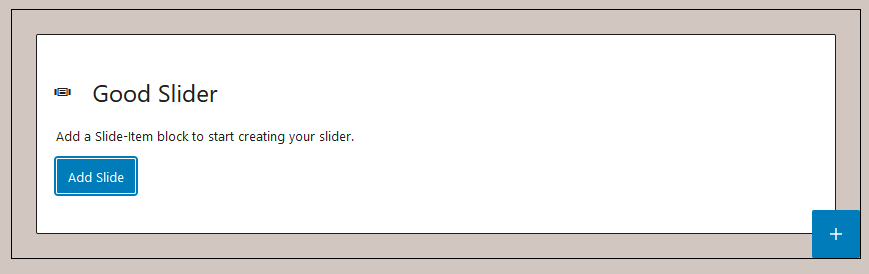

# Good Slider

WordPress plugin with a very simple slider block which is based on [Swiper](https://swiperjs.com/).
As of now, the plugin does not provide any slider configuration in the editor UI but provides many **PHP filter hooks** to change its behaviour.

The plugin is used in some custom themes and through it's PHP configuration it's perfect for a locked-in design (eg agency, clients).
Through the filters it's also very easy to extend in your own functions.php file.

