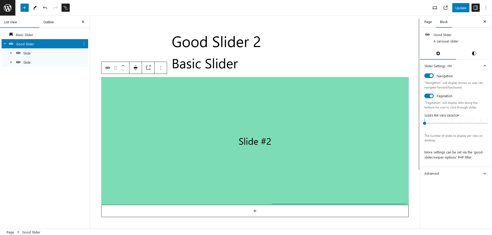

# Good Slider

This WordPress plugin provides a very simple slider block which is based on [Swiper v8](https://swiperjs.com/).
The plugin provides a UI for the most common swiper options (navigation, pagination, slides per view). But it is
specifically made to be extended via PHP.
Therefore, it provides many **PHP filter hooks** to change its behaviour.

The plugin is used in some custom themes and through it's PHP configuration it's perfect for a locked-in design (eg
agency, clients).
Through the filters it's also very easy to extend in your own functions.php file.

